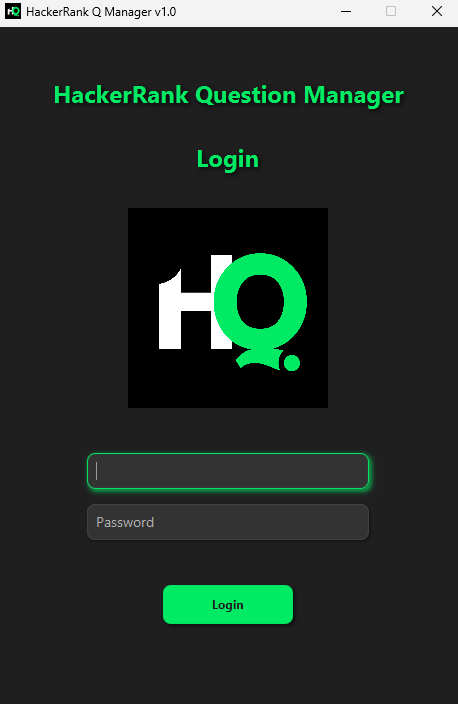
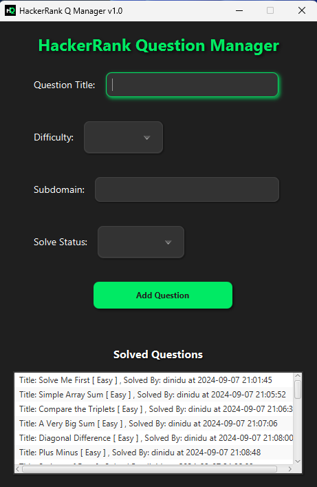

# <p align="center">HackerRankQM v1</p>

<p align="center">
  
</p>

<p align="center">
  🎉 Welcome to HackerRankQM! 🎉
</p>

<p align="center">
  HackerRankQM is a Java-based application designed to manage and track HackerRank questions. It leverages JavaFX for the user interface and MySQL for database management. This project uses Maven for dependency management and build automation.
</p>

## Table of Contents

- [Features](#features)
- [Requirements](#requirements)
- [Installation](#installation)
- [Usage](#usage)
- [Project Structure](#project-structure)
- [Contributing](#contributing)
- [Sample Images](#sample-images)

## Features

- **User Interface**: A sleek and intuitive UI built with JavaFX.
- **Database Integration**: Seamless interaction with MySQL to store and manage questions.
- **Question Management**: Efficiently add, view, and manage your HackerRank questions.
- **Status Tracking**: Keep track of question statuses such as Solved and Unsolved.

## Requirements

- Java 22
- Maven 3.6.0
- MySQL 8.0

## Installation

1. **Clone the repository**:
    ```sh
    git clone https://github.com/kdj-pro/HackerankQ.git
    cd HackerankQ
    ```

2. **Configure the database**:
    - Set up a MySQL database and update the connection details in the application configuration.

3. **Build the project**:
    ```sh
    mvn clean install
    ```

4. **Run the application**:
    ```sh
    mvn javafx:run
    ```

## Usage

1. **Launch the application**:
    - Start the application using the Maven command `mvn javafx:run`.

2. **Add a question**:
    - Enter the question details in the form and click "Add".

3. **View questions**:
    - Browse through the list of questions to view their details.

## Contributing

Contributions are encouraged! To contribute:

1. Fork the repository.
2. Create a new branch (`git checkout -b feature-branch`).
3. Commit your changes (`git commit -m 'Add some feature'`).
4. Push to the branch (`git push origin feature-branch`).
5. Open a pull request.

## Sample Images

<p align="center">
  
  
</p>

## Thank You

<p align="center">
  Thank you for your interest in HackerRankQM! I appreciate your contributions and feedback. 🚀
</p>

